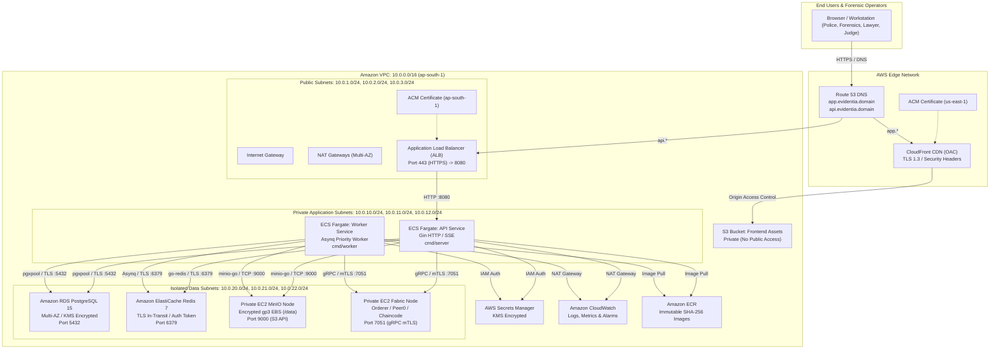
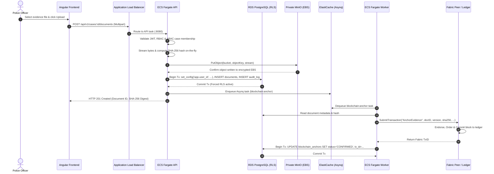

# Evidentia — AWS Production Architecture Specification

**System Classification:** Mission-Critical Digital Evidence Management System (DEMS)  
**Security Level:** Zero Trust / CJIS & ISO 27001 Aligned / Evidence Tamper Evident  
**Target AWS Region:** Primary: `ap-south-1` (Mumbai); Global CDN: CloudFront Edge Network

---

## 1. Architectural Principles

1. **Evidence Integrity Above All:** Original digital evidence objects are immutable and must never be altered or overwritten.
2. **Defense-in-Depth:** Application-level RBAC and ABAC are strictly reinforced at the database layer by PostgreSQL Row-Level Security (`FORCE ROW LEVEL SECURITY`).
3. **Zero Public Footprint for Data Services:** Databases, caches, object stores, and blockchain nodes reside in non-routable private data subnets without public IPs.
4. **Decoupled Asynchronous Processing:** Resource-heavy cryptographic verifications and blockchain anchoring are executed by dedicated ECS Fargate workers via Redis-backed Asynq priority queues.
5. **Off-Chain Ledger Pattern:** Hyperledger Fabric stores only cryptographic digests (SHA-256), timestamps, transaction IDs, and custody event metadata; evidence files remain in encrypted object storage.

---

## 2. Global Architecture Diagram

---

## 3. Network Architecture & Subnet Planning

### 3.1 Subnet Allocation Table
| Subnet Tier | Availability Zone | CIDR Block | Route Table Target | Purpose |
|---|---|---|---|---|
| **Public-1** | `ap-south-1a` | `10.0.1.0/24` | Internet Gateway (`igw-xxxx`) | ALB, NAT Gateway A |
| **Public-2** | `ap-south-1b` | `10.0.2.0/24` | Internet Gateway (`igw-xxxx`) | ALB, NAT Gateway B |
| **Public-3** | `ap-south-1c` | `10.0.3.0/24` | Internet Gateway (`igw-xxxx`) | ALB, NAT Gateway C |
| **Private-App-1** | `ap-south-1a` | `10.0.10.0/24` | NAT Gateway A | ECS Fargate API & Worker |
| **Private-App-2** | `ap-south-1b` | `10.0.11.0/24` | NAT Gateway B | ECS Fargate API & Worker |
| **Private-App-3** | `ap-south-1c` | `10.0.12.0/24` | NAT Gateway C | ECS Fargate API & Worker |
| **Private-Data-1** | `ap-south-1a` | `10.0.20.0/24` | Local VPC Only (No IGW/NAT) | RDS Primary, MinIO EC2 |
| **Private-Data-2** | `ap-south-1b` | `10.0.21.0/24` | Local VPC Only (No IGW/NAT) | RDS Standby, Fabric EC2 |
| **Private-Data-3** | `ap-south-1c` | `10.0.22.0/24` | Local VPC Only (No IGW/NAT) | ElastiCache Redis Cluster |

---

## 4. Security Group Ingress / Egress Matrix

| Security Group | Ingress Source | Allowed Ports | Purpose / Justification |
|---|---|---|---|
| **`evidentia-alb-sg`** | `0.0.0.0/0` | `80`, `443` TCP | Public ingress; port 80 redirects to 443 with HSTS |
| **`evidentia-ecs-api-sg`** | `evidentia-alb-sg` | `8080` TCP | Only ALB target group can send HTTP traffic to API |
| **`evidentia-ecs-worker-sg`**| None | None | No inbound ports; worker initiates outbound connections only |
| **`evidentia-rds-sg`** | `evidentia-ecs-api-sg`, `evidentia-ecs-worker-sg` | `5432` TCP | PostgreSQL traffic strictly limited to API and Worker containers |
| **`evidentia-redis-sg`** | `evidentia-ecs-api-sg`, `evidentia-ecs-worker-sg` | `6379` TCP | Redis connection strictly limited to API and Worker containers |
| **`evidentia-minio-sg`** | `evidentia-ecs-api-sg`, `evidentia-ecs-worker-sg` | `9000` TCP | S3 API requests from API and Worker; no public access |
| **`evidentia-fabric-sg`**| `evidentia-ecs-api-sg`, `evidentia-ecs-worker-sg` | `7051` TCP | Peer gRPC mTLS interface from backend services |

---

## 5. Component Breakdown & Configurations

### 5.1 Frontend Delivery (S3 + CloudFront)
- **Bucket Configuration:** Private S3 bucket with versioning enabled and default AES-256 KMS encryption. Public access blocked 100%.
- **Origin Access Control (OAC):** CloudFront signs all requests using AWS SigV4. Bucket policy allows only `cloudfront.amazonaws.com` service principal matching the specific CloudFront distribution ARN.
- **SPA Routing:** CloudFront custom error responses map HTTP `403` and `404` status codes to `/index.html` with response code `200` to support Angular Router deep-linking.
- **Caching Strategy:**
  - `/index.html`: `Cache-Control: no-cache, no-store, must-revalidate`
  - `/assets/*`, `*.js`, `*.css`: `Cache-Control: public, max-age=31536000, immutable`

### 5.2 API & Worker Compute (Amazon ECS Fargate)
- **Runtime:** Minimal hardened Alpine Linux container (`alpine:3.19`), running as non-root user `evidentia` (UID 10001).
- **Separation of Concerns:**
  - **API Service:** Runs `cmd/server` with `DISABLE_EMBEDDED_WORKER=true`. Serves REST endpoints, SSE streams, and health checks on port 8080.
  - **Worker Service:** Runs `cmd/worker`. Processes Asynq queues (`critical=6`, `default=2`) for audit verification and Fabric blockchain anchoring. No listening ports.
- **Auto-Scaling:** Target tracking scaling policies based on ECS CPU utilization (>70%) and ALB Target Response Time (>1.5s).

### 5.3 Database Layer (Amazon RDS PostgreSQL 15)
- **High Availability:** Multi-AZ deployment across two availability zones with automatic synchronous replication and failover.
- **Encryption:** Storage encrypted using customer-managed AWS KMS keys (`aws/rds`).
- **Connection Security:** Forced SSL/TLS (`rds.force_ssl = 1`).
- **Row-Level Security:** Enforced at table level. API connection pool connects as `evidentia_app`, an unprivileged user without `BYPASSRLS` privileges.
- **Backups:** Automated daily snapshots retained for 30 days with point-in-time recovery (PITR) within a 5-minute RPO window.

### 5.4 Cache & Messaging (Amazon ElastiCache for Redis 7)
- **Security:** In-transit encryption (TLS) enabled; Redis AUTH token required; at-rest encryption enabled with KMS.
- **Eviction Policy:** `noeviction` configured in parameter group to guarantee zero task loss in Asynq priority queues.
- **Pub/Sub Channel:** Real-time event fan-out for SSE clients across multiple API tasks.

### 5.5 Object Storage (MinIO on Private EC2)
- **Instance Configuration:** EC2 instance (`t3.medium`) deployed in Private Data Subnet without public IP.
- **Storage Volume:** Dedicated KMS-encrypted `gp3` EBS volume (200 GB, 3000 IOPS) mounted at `/data`.
- **Systemd Managed:** Configured with restart-on-failure and automated bucket initialization.
- **Zero Presigned URLs:** All evidence uploads and downloads stream through the backend API to enforce authentication, RLS authorization, SHA-256 integrity verification, and watermark stamping.

### 5.6 Blockchain Provenance (Hyperledger Fabric 2.5 on Private EC2)
- **Node Setup:** Private EC2 instance (`t3.large`) running Hyperledger Fabric 2.5 Orderer, Peer, and Chaincode containers.
- **Persistence:** Dedicated KMS-encrypted `gp3` EBS volume (150 GB) mounted at `/var/hyperledger`.
- **Smart Contract:** `chaincode/evidentia` executes `AnchorEvidence`, `GetEvidence`, `GetEvidenceLatest`, and `GetEvidenceHistory`.
- **Off-Chain Pattern:** No raw evidence files are stored on-chain. Only 32-byte SHA-256 hashes, case references, version numbers, and actor MSP identities are anchored.

---

## 6. End-to-End Evidence Lifecycle & Integrity Verification

---

## 7. Forensic Watermark & Provenance Architecture

When an authenticated user requests an evidence export (`POST /api/v1/documents/:id/export`):
1. **Download ID Generation:** A cryptographically secure random UUID is generated.
2. **Metadata Capture:** Caller's user ID, role, client IP (from `X-Forwarded-For` validated against `TRUSTED_PROXIES`), User-Agent, and timestamp are captured.
3. **Forensic Steganography:** `internal/service/watermark_service.go` encrypts the metadata using AES-256-GCM (server master key) and embeds the payload after the file's natural EOF marker (JPEG EOI, PNG IEND, or PDF `%%EOF`).
4. **Export Fingerprint:** A separate SHA-256 hash of the exported file is computed and recorded in `evidence_exports`.
5. **Verification Capability:** Any exported evidence file submitted to `POST /api/v1/admin/exports/verify-watermark` can be verified to extract the original downloader, timestamp, IP, and original document hash, proving chain of custody.
