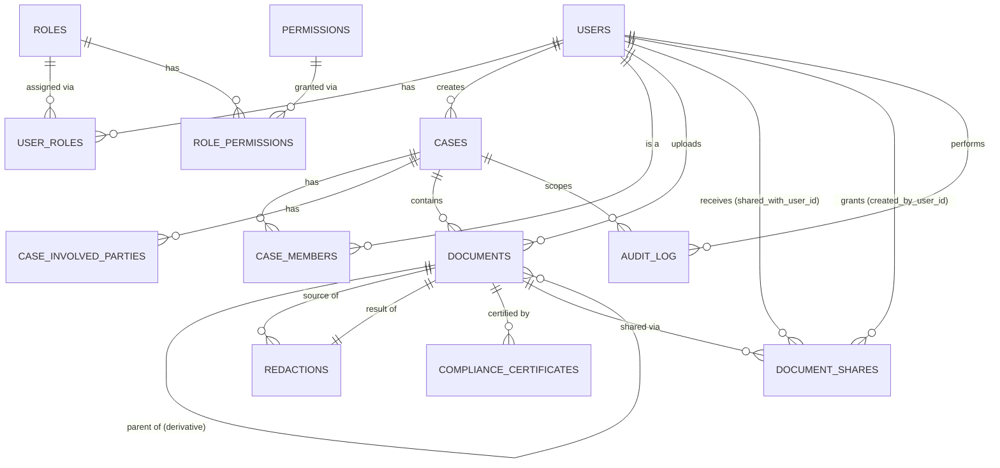

# Database Schema

## Purpose

The PostgreSQL schema for Evidentia — the core (System 2, Database & Data
Layer) plus `document_shares`, added later by the document-sharing
system on top of it (`db/migrations/000004_document_sharing.up.sql`).
This document describes what exists today: 13 tables, their
relationships, Row-Level Security policies, and the privilege model that
makes the audit log append-only at the database level, not just by
application convention.

Business logic that *uses* this schema (authentication, RBAC/ABAC
enforcement, document upload, redaction processing, the audit-chain
writer/verifier, compliance certificate generation, document sharing) is
explicitly **not** implemented here — see [ARCHITECTURE.md](../ARCHITECTURE.md)
for which system owns each.

## Entities

```text
users
roles
permissions
user_roles
role_permissions
cases
case_members
case_involved_parties
documents
redactions
audit_log
compliance_certificates
document_shares
```

There is no `refresh_tokens` table (an earlier scaffold placeholder):
refresh-token handling is System 3's concern and its storage shape isn't
settled yet. There is no `agencies` table — see "Design Decisions" below.

## Entity Relationships



Plain-text view, for reference alongside the diagram:

```text
Users
 ├──── User Roles ──── Roles ──── Role Permissions ──── Permissions
 │
 ├──── Cases (created_by)
 │       │
 │       ├──── Case Members
 │       │
 │       ├──── Case Involved Parties
 │       │
 │       └──── Documents
 │                │
 │                ├──── Redactions (source_document_id / result_document_id)
 │                │
 │                ├──── Compliance Certificates
 │                │
 │                └──── Document Shares (shared_with_user_id, created_by_user_id -> Users)
 │
 └──── Audit Log (user_id, case_id — both nullable)
```

## Design Decisions

Each of these was a real choice among alternatives — see the migration
file's header/table comments for the fuller reasoning inline with the SQL.

| Decision | Choice | Why |
|---|---|---|
| Primary keys | `UUID DEFAULT gen_random_uuid()` everywhere | Consistent identifier strategy; `gen_random_uuid()` is built into Postgres core since v13, no extension needed |
| Timestamps | `TIMESTAMPTZ`, `DEFAULT now()` | UTC-normalized, never `TIMESTAMP WITHOUT TIME ZONE` |
| Email uniqueness | `citext` column + `UNIQUE` | Case-insensitive by construction — no query has to remember `lower(email)` |
| Controlled vocabularies (status, document_type, membership_type, party_type) | `TEXT` + `CHECK`, not native `ENUM` | Adding a value later is `DROP`/`ADD CONSTRAINT` — no `ALTER TYPE ... ADD VALUE` transactional restrictions |
| Hashes (`sha256_hash`, `audit_log.hash`/`prev_hash`, `compliance_certificates.document_hash`) | `BYTEA`, `CHECK (octet_length(...) = 32)` | True binary data; hex-encode only at the API/JSON boundary |
| Audit ordering | `seq BIGINT GENERATED ALWAYS AS IDENTITY`, `id UUID` kept as external identifier | Deterministic, gap-free ordering for chain traversal — timestamps alone aren't trusted (clock skew, concurrent inserts) |
| Deletes | No hard-delete path for users/cases/documents/audit_log/certificates — `RESTRICT` on FKs into them, no `DELETE` grant on the runtime role | Evidence-integrity posture: lifecycle is status/timestamp-based (`status`, `removed_at`), never row deletion |
| Agencies | **No separate table** | Not in the core domain list; per-case storage isolation already works off `case_id` alone. Document sharing (`document_shares`) reuses this exact same `case_id`-scoped isolation rather than inventing an agency concept — see docs/SECURITY.md's "Document Sharing" |
| `document_type`/`document.status` | No `DELETED` status | Evidence is archived, never deleted, even at the vocabulary level |
| `document_shares.status` | Only `ACTIVE`/`REVOKED` stored — no `EXPIRED` value | Expiration is a pure function of `expires_at` vs. `now()`, evaluated fresh on every access check (application AND RLS) rather than written back — the same "never repaired/rewritten" posture `documents.sha256_hash` follows |
| RLS ↔ RLS recursion (`documents_select` needs to check `document_shares`, whose own policy needs to check `documents`) | A `SECURITY DEFINER` function (`has_active_document_share`, owned by the superuser migrator role) | Breaks the cycle: the function bypasses `document_shares`'s RLS internally (superusers are RLS-exempt regardless of `FORCE`), so `documents_select` never re-enters its own policy. See the migration's `CREATE FUNCTION` comment and docs/SECURITY.md's "Document Sharing" for the full incident/fix |

## Row-Level Security

RLS is enabled (and `FORCE`d, so even the table owner is subject to it) on
eight tables: `cases`, `case_members`, `case_involved_parties`,
`documents`, `redactions`, `compliance_certificates`, `audit_log`,
`document_shares`. `documents`/`compliance_certificates`'s own `SELECT`
policies additionally consult `document_shares` (via the
`has_active_document_share` `SECURITY DEFINER` function — see the Design
Decisions table above) as a SECOND, narrower authorization path alongside
case membership.

`users`, `roles`, `permissions`, `user_roles`, `role_permissions`
deliberately do **not** get RLS — there is no per-row ownership rule for
this reference/identity data at this system's scope, and enabling RLS
without a real rule to express would be the "confusing behavior" the
project's own design principles warn against. They're protected by
table-level grants instead.

### The mechanism

Two SQL functions read transaction-local settings the application sets at
the start of every request-scoped transaction:

```sql
current_app_user_id() -- reads app.user_id, NULL if unset/invalid
current_app_role()    -- reads app.role,    NULL if unset
```

The Go side sets these via `internal/repository.WithTx` (see
[../backend/internal/repository/tx.go](../backend/internal/repository/tx.go)):

```go
repository.WithTx(ctx, pool, repository.AppIdentity{UserID: id, Role: role}, func(ctx context.Context, q *generated.Queries) error {
    // every query in here runs with app.user_id/app.role set for THIS
    // transaction only (set_config(..., true)) — never leaked to another
    // request reusing the same pooled connection, committed or not.
})
```

**This is the only correct way to query a protected table.** Even a single
read needs the identity context established first — there is deliberately
no non-transactional query path in `internal/repository`.

### The rule

Fundamental row isolation only: *you must be an active member of a case
(`case_members`, `removed_at IS NULL`) — or be `ADMIN` — to see anything
scoped to it.* Role-specific business rules (police jurisdiction scope,
judge docket assignment, ...) are **not** hardcoded into policies — that's
application-layer ABAC (a later system) deciding which `case_members` rows
to create/query in the first place. RLS is the backstop that keeps a bug in
that application logic from leaking cross-case data; it doesn't replace it
(defense in depth, per the project's security principles).

A case's creator (`cases.created_by`) can always see and update their own
case directly, independent of case membership — this isn't a shortcut, it
resolves a genuine bootstrap ordering problem: the first `case_members`
row for a new case can't be inserted until the case itself is visible, and
membership is what visibility normally depends on.

### A hard-won constraint: no self-referential policies

`case_members` policies must never query `case_members` itself (directly,
or via a subquery that in turn queries it again) — Postgres detects that
as **infinite recursion** and errors the query outright (empirically
confirmed while writing this migration). Policies on `case_members` check
the row's own columns, or query other tables (`cases`), never itself. The
practical consequence: a member sees their *own* membership row through
this table, but not (via this table alone) their co-members' — listing a
case's full team is deferred to a later system.

### Fail-closed, verified empirically

No app identity set → zero visible rows on every protected table, not
unrestricted access. See
`backend/tests/db_rls_test.go::TestRLS_FailsClosedWithoutIdentity` and
`TestRLS_TransactionLocalIdentityDoesNotLeak` (the latter proves the
identity really is transaction-scoped, even reusing the same physical
connection across transactions — the property a connection-pooled
application depends on).

## Security / Privilege Model

Two distinct Postgres login roles:

- **Migrator** (`DATABASE_MIGRATOR_USER`/`PASSWORD`, e.g. the Postgres
  bootstrap superuser in local dev) — owns every table, runs migrations,
  never used by the running server.
- **`evidentia_app`** (created by the migration itself) — what the running
  server connects as. `NOSUPERUSER`, `NOBYPASSRLS`, owns nothing, and
  receives only explicit `GRANT`s:

  | Table(s) | Runtime privileges |
  |---|---|
  | `roles`, `permissions`, `role_permissions` | `SELECT` only |
  | `users` | `SELECT`, `INSERT`, `UPDATE` |
  | `user_roles` | `SELECT`, `INSERT`, `UPDATE`, `DELETE` |
  | `cases`, `case_members`, `case_involved_parties`, `documents` | `SELECT`, `INSERT`, `UPDATE` |
  | `redactions`, `compliance_certificates` | `SELECT`, `INSERT` only (immutable once created) |
  | **`audit_log`** | **`SELECT`, `INSERT` only — no `UPDATE`, no `DELETE`** |

The `audit_log` restriction is the hard security requirement: append-only
is enforced by PostgreSQL's own privilege system, not merely by application
code choosing not to call an update. Verified empirically (not just
asserted) in
`backend/tests/db_audit_privileges_test.go`, which:

- attempts `UPDATE`/`DELETE` on `audit_log` as `evidentia_app` and
  confirms `permission denied`
- confirms `evidentia_app` does **not** own `audit_log`
  (`pg_class.relowner`)
- confirms `evidentia_app` has neither `rolsuper` nor `rolbypassrls`
- confirms the exact grant set on `audit_log` is `{SELECT, INSERT}`, no more
- confirms the "at most one genesis entry" and "one canonical predecessor
  per entry" constraints (below) actually reject violations

### Audit-chain storage invariants (structure only — no chain logic yet)

- `audit_log.hash` / `prev_hash`: `BYTEA`, exactly 32 bytes when present.
- At most one row may have `prev_hash IS NULL` (the genesis entry) —
  enforced by a unique index on a constant expression filtered to those
  rows (`idx_audit_log_single_genesis`), the standard Postgres idiom for
  "at most one," since a plain `UNIQUE` constraint treats every `NULL` as
  distinct and wouldn't catch a second one.
- No two rows may claim the same non-null `prev_hash`
  (`idx_audit_log_prev_hash_unique`) — "one canonical predecessor → one new
  entry."
- Computing `hash`/`prev_hash` from entry content is System 8's
  responsibility (`internal/audit.ComputeEntryHash` — see
  [AUDIT_CHAIN.md](./AUDIT_CHAIN.md)); this migration only guarantees the
  storage can't represent a malformed chain regardless of what any writer
  computes.

## JSONB Usage

| Column | Why JSONB |
|---|---|
| `cases.metadata` | Flexible, evolving per-case attributes |
| `case_involved_parties.metadata` | **Sensitive** — may hold PII (contact details, statements). Protected today only by case-membership row visibility (RLS); column/field-level redaction for specific roles is application-layer ABAC, not implemented |
| `documents.metadata` | Per-document-type flexible metadata |
| `redactions.region_data` | Redaction coordinates/pages — shape expected to evolve with the redaction UI, not fixed here |
| `audit_log.metadata` | Free-form context for an audit entry |
| `compliance_certificates.certificate_data` | Certificate signing metadata not covered by the table's own columns — `{signature_algorithm, signature, issuer}` (System 7; see `internal/service.certificatePayloadData`). The document hash/version/generator/timestamp are real columns, not JSONB — this holds only what has no dedicated column |

Core relationships stay fully relational (foreign keys, not JSONB
references) — JSONB is used only where the project explicitly benefits
from schema flexibility, never as a substitute for real structure.

## Migrations

[`golang-migrate`](https://github.com/golang-migrate/migrate), used as a
Go library (`cmd/migrate`), not a separately installed CLI:

```bash
cd backend
export DATABASE_MIGRATOR_USER=... DATABASE_MIGRATOR_PASSWORD=...
go run ./cmd/migrate up       # or: down, version
```

Or via `make migrate-up` / `make migrate-down` from `backend/` (or the
repository root, via the delegating root `Makefile`).

`000001_init_schema.{up,down}.sql` is the foundation migration. Ordering
inside it: extensions → roles → permissions → users → user_roles →
role_permissions → cases → case_members → case_involved_parties →
documents → redactions → audit_log → compliance_certificates → RLS helper
functions → RLS policies → the `evidentia_app` role and its grants.

`000003_certificate_integrity.{up,down}.sql` (System 7) adds exactly one
thing: `UNIQUE (document_id, document_hash)` on `compliance_certificates`
(`compliance_certificates_document_hash_unique`) — the database-level
guarantee that two concurrent "generate a certificate for this document"
requests can never both succeed, backing `CreateCertificate`'s
`INSERT ... ON CONFLICT ... DO NOTHING` (see
[SECURITY.md](./SECURITY.md)'s "Concurrency" under Document Verification
& Compliance Certificates). It is a `(document_id, document_hash)` pair,
not `document_id` alone, matching the table's own existing design intent
(a certificate is bound to the exact hash it represents) and remaining
correct if a future system ever legitimately produces more than one
canonical hash per document. (`000002_auth_sessions` predates this,
added by System 3.)

`000004_document_sharing.{up,down}.sql` (the document-sharing system)
adds `document_shares` (see "Entities" above), the
`has_active_document_share` `SECURITY DEFINER` helper function, and
extends `documents_select`/`compliance_certificates_select` (via
`ALTER POLICY`, never a DROP+recreate) with a delegated-access
OR-branch — see the Design Decisions table above and
[SECURITY.md](./SECURITY.md)'s "Document Sharing" for the full RLS-
recursion incident this function exists to fix.

The down migration is safe to run repeatedly against development/test
databases (verified in `backend/tests/db_migration_test.go`, which applies
it via the real `golang-migrate` library against an isolated database, not
a hand-rolled reimplementation). It is **not** an operationally casual
action against a database holding real evidence.

`evidentia_app`'s password is created as a documented placeholder
(`changeme_example`, the same convention used throughout this repository's
`.env.example`/`docker-compose.yml`) — rotate it for any non-throwaway
environment with `ALTER ROLE evidentia_app WITH PASSWORD '...'`, run as an
operational step outside version control.

## sqlc

Configuration: [`backend/sqlc.yaml`](../backend/sqlc.yaml). Generates into
`backend/db/generated/` (never hand-edited — fix the SQL or config and
regenerate).

```bash
cd backend
sqlc generate   # requires the sqlc CLI: go install github.com/sqlc-dev/sqlc/cmd/sqlc@latest
```

Type overrides worth knowing about:

- `uuid` → `github.com/google/uuid.UUID` (already a transitive dependency;
  far cleaner than `pgtype.UUID` for a type used as the primary-key
  strategy everywhere)
- `citext` → `string`
- `timestamptz` → `time.Time` for non-null columns. The two nullable
  `timestamptz` columns (`case_members.removed_at`, `users.last_login_at`)
  are **not** overridden: sqlc v1.31.1 double-wraps a custom nullable
  override specifically for `time.Time` (produces `**time.Time` — a quirk
  not seen with the `uuid` override, confirmed while writing this config).
  Those two columns generate as `pgtype.Timestamptz` instead; convert
  explicitly (`.Time`/`.Valid`) where needed.
- `jsonb` → `encoding/json.RawMessage`

Query files live in `backend/db/queries/*.sql`, one per domain
(`users.sql`, `roles.sql`, `permissions.sql`, `cases.sql`,
`case_members.sql`, `case_involved_parties.sql`, `documents.sql`,
`redactions.sql`, `audit.sql`, `certificates.sql`, `shares.sql`). Every query lists
columns explicitly — no `SELECT *` — so a schema change surfaces as a
compile error in `db/generated`, not a silent runtime mismatch.
`password_hash` is selected by exactly one query
(`GetUserByEmailForAuth`), named so its one legitimate caller (System 3's
login flow) is unmistakable; every other user query omits it.

## Repository Layer

`backend/internal/repository/` wraps the generated queries with thin
per-domain structs (`UserRepo`, `CaseRepo`, `DocumentRepo`, `AuditRepo`,
`CertificateRepo`) — close to 1:1 with sqlc methods, not a speculative
abstraction. `internal/models` re-exports the generated row types as
aliases (`type Case = generated.Case`, etc.) plus symbolic constants for
each controlled-vocabulary column (`models.CaseStatusOpen`,
`models.RoleAdmin`, ...), so later systems import a stable path without
duplicating struct definitions.

## Seed Data

`backend/db/seed/001_reference_data.sql`, applied via
`backend/scripts/seed_db.sh` (uses the migrator credentials — writing to
`role_permissions` needs them; `evidentia_app` only has `SELECT` there).
Idempotent (`ON CONFLICT DO NOTHING` throughout — safe to run twice).

Seeds: the five roles (`ADMIN`, `POLICE`, `FORENSICS`, `LAWYER`, `JUDGE`),
the permission catalog (`case:create`, `document:upload`, `audit:read`,
...), and a starting role→permission mapping. **No user rows** — seeding a
real user needs a bcrypt `password_hash`, which is System 3's territory;
hardcoding one here would violate "never a real password in version
control" even as a placeholder.
