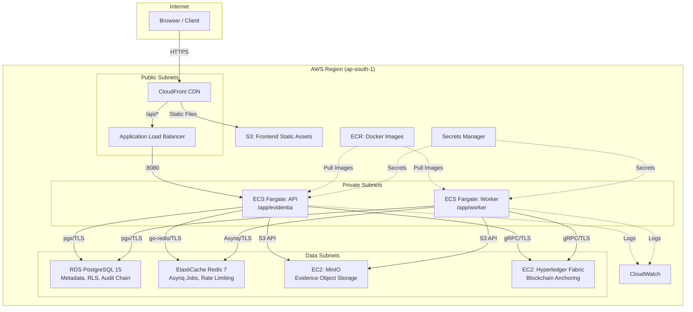

# AWS Architecture

## Overview

Evidentia runs on AWS using a three-tier architecture that preserves all
existing security guarantees (RLS, RBAC, ABAC, audit chain, blockchain
anchoring, off-chain evidence storage) while leveraging managed AWS
services for reliability and operational simplicity.

## Architecture Diagram



## Service Mapping

| Local (docker-compose) | AWS Service | Notes |
|----------------------|-------------|-------|
| `backend` (server) | ECS Fargate (API task) | Same image, `DISABLE_EMBEDDED_WORKER=true` |
| `backend` (worker) | ECS Fargate (Worker task) | Same image, `/app/worker` entrypoint |
| `migrate` (init) | ECS Run Task (one-shot) | `cmd/migrate up`, runs before API |
| `postgres` | RDS PostgreSQL 15 | `db.t3.micro` (demo), `sslmode=require` |
| `redis` | ElastiCache Redis 7 | `cache.t3.micro` (demo), TLS in-transit |
| `minio` | EC2 + MinIO | Private subnet, SG-locked to ECS |
| `fabric-*` | EC2 + Fabric | Private subnet, SG-locked to ECS |
| `reverse-proxy` (nginx) | ALB + CloudFront | TLS at ALB (ACM), CDN for frontend |
| `frontend` (nginx) | S3 + CloudFront | Static files, SPA fallback via CF error pages |
| `.env` / secrets | Secrets Manager | Injected as ECS secrets |
| Docker logs | CloudWatch Logs | Structured JSON, 30-day retention |

## Network Architecture

```
VPC: 10.0.0.0/16
├── Public Subnets (10.0.0.0/24, 10.0.1.0/24)
│   ├── Internet Gateway
│   ├── NAT Gateway
│   └── ALB
├── Private Subnets (10.0.10.0/24, 10.0.11.0/24)
│   ├── ECS API Service
│   └── ECS Worker Service
└── Data Subnets (10.0.20.0/24, 10.0.21.0/24)
    ├── RDS PostgreSQL
    ├── ElastiCache Redis
    ├── EC2 MinIO
    └── EC2 Fabric
```

## Security Groups

| Security Group | Inbound From | Ports | Purpose |
|---------------|-------------|-------|---------|
| `alb-sg` | `0.0.0.0/0` | 80, 443 | Public HTTP/HTTPS |
| `ecs-sg` | `alb-sg` | 8080 | API from ALB only |
| `rds-sg` | `ecs-sg` | 5432 | PostgreSQL from ECS only |
| `redis-sg` | `ecs-sg` | 6379 | Redis from ECS only |
| `minio-sg` | `ecs-sg` | 9000 | MinIO from ECS only |
| `fabric-sg` | `ecs-sg` | 7050-7054 | Fabric from ECS only |

No service has a direct path from the Internet except the ALB.

## Encryption

| Layer | Mechanism |
|-------|-----------|
| Client ↔ CloudFront | TLS 1.2+ (ACM certificate) |
| CloudFront ↔ ALB | TLS 1.2 (ACM certificate) |
| ALB ↔ ECS | HTTP (private VPC, never leaves AWS) |
| ECS ↔ RDS | TLS (`DATABASE_SSLMODE=require`) |
| ECS ↔ ElastiCache | TLS (`REDIS_TLS=true`) |
| ECS ↔ MinIO | HTTPS (`MINIO_USE_SSL=true`) |
| ECS ↔ Fabric | gRPC TLS (Fabric TLS CA cert) |
| RDS at rest | AES-256 (AWS-managed KMS key) |
| ElastiCache at rest | AES-256 (AWS-managed KMS key) |
| S3 at rest | AES-256 (default encryption) |
| ECR images | AES-256 (default encryption) |

## Health Checks

| Component | Check | Path | Interval |
|-----------|-------|------|----------|
| ALB → API | HTTP 200 | `/health` | 30s |
| ECS Container | wget | `http://localhost:8080/health` | 30s |
| Readiness | HTTP 200 | `/ready` (checks DB, Redis, MinIO) | On-demand |

## Preserved Guarantees

All 25 Evidentia architectural principles are preserved on AWS:

1. **Off-chain evidence** — MinIO on EC2, not S3 (preserves S3-compatible API)
2. **PostgreSQL as authoritative metadata** — RDS PostgreSQL 15, same schema
3. **RLS enforcement** — `evidentia_app` role, `SET LOCAL` per-request
4. **Audit chain** — Append-only, hash-chained, same migration schema
5. **Blockchain anchoring** — Fabric on EC2, same gRPC integration
6. **Rate limiting** — Redis-backed, works across ECS replicas
7. **CORS validation** — Same `internal/config` validation
8. **Security headers** — Same `middleware.SecurityHeaders()`
9. **Separate worker** — `DISABLE_EMBEDDED_WORKER=true` on API task
10. **Graceful shutdown** — ECS SIGTERM → Go shutdown sequence
